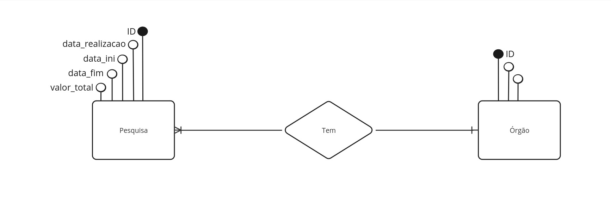
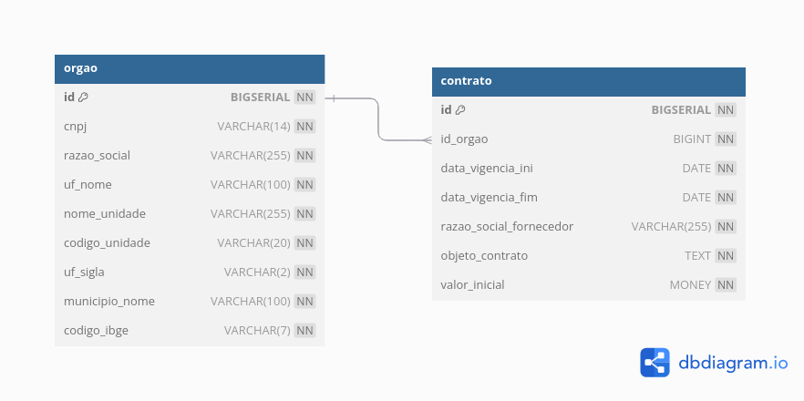

# Requisitos Funcionais - Obrigatórios

1. **Consumo da API do PNCP**:
   - Implementar a funcionalidade que consome a API REST do Portal Nacional de Contratações Públicas (PNCP) para obter informações sobre contratos.
   - A busca deve ser realizada utilizando o CNPJ de um órgão público e um intervalo de datas (data inicial e final).

2. **Exibição das Informações do Órgão**:
   - Exibir na página web as informações detalhadas do órgão público associado ao CNPJ fornecido.
   
3. **Listagem de Contratos**:
   - Listar todos os contratos do órgão que possuem a data de início de vigência dentro do período especificado.
   - Para cada contrato listado, devem ser exibidos os seguintes detalhes:
     - Data de vigência inicial.
     - Data de vigência final.
     - Razão social do fornecedor.
     - Objeto do contrato.
     - Valor inicial do contrato.

4. **Cálculo e Exibição do Valor Total**:
   - Calcular e exibir o valor total somado de todos os contratos obtidos dentro do período especificado.

5. **Armazenamento em Banco de Dados**:
   - Inserir todas as informações coletadas dos contratos e do órgão em um banco de dados para posterior consulta.

6. **Documentação e Comentários**:
   - Comentar o código-fonte de forma a garantir uma fácil compreensão por parte dos avaliadores.

7. **Entrega e Envio**:
   - Enviar o código desenvolvido junto com screenshots da aplicação para o e-mail especificado até a data limite de 02/09/2024.

# Requisitos Não Funcionais

Este projeto foi desenvolvido utilizando tecnologias modernas e ferramentas robustas, tanto no Front-End quanto no Back-End, visando garantir desempenho, escalabilidade e facilidade de manutenção.

## Front-End

Para o desenvolvimento do Front-End, foram utilizadas as seguintes tecnologias:

- **Linguagem de Programação**:
  - **JavaScript**: A linguagem principal para o desenvolvimento das funcionalidades dinâmicas da interface.

- **Linguagens de Marcação e Estilo**:
  - **HTML5**: Para a estruturação semântica do conteúdo das páginas.
  - **CSS3**: Para a estilização visual e responsividade da interface.

- **Frameworks**:
  - **Vite + ReactJS**: Utilizado para construir uma aplicação modular, rápida e eficiente. Vite oferece um ambiente de desenvolvimento ágil, enquanto ReactJS possibilita a criação de componentes reutilizáveis e a construção de interfaces de usuário interativas.

## Back-End

O Back-End foi desenvolvido utilizando tecnologias robustas que permitem a construção de uma API segura e escalável:

- **Linguagem de Programação**:
  - **Java**: Linguagem amplamente utilizada para o desenvolvimento de aplicações corporativas, conhecida por sua robustez e capacidade de escalabilidade.

- **Frameworks**:
  - **Spring Boot**: Framework que facilita o desenvolvimento de aplicações Java, proporcionando um ambiente simplificado para a configuração e implementação de APIs RESTful, além de oferecer suporte a diversas funcionalidades, como segurança e persistência de dados.

## Banco de Dados

A estrutura do banco de dados foi cuidadosamente planejada e implementada utilizando ferramentas e tecnologias amplamente reconhecidas na indústria. O processo de desenvolvimento envolveu várias etapas, desde a concepção inicial até a implementação final, garantindo uma modelagem consistente e eficiente.

- **Miro**:
  - Ferramenta colaborativa utilizada para criar o DER (Diagrama Entidade-Relacionamento). Essa etapa visual foi fundamental para entender e planejar as interações entre as diferentes entidades do sistema.
  
- **Dbdiagram.io**:
  - Plataforma especializada na criação de diagramas de banco de dados, usada para desenvolver a modelagem lógica. Através dessa ferramenta, foi possível transformar o DER em um esquema lógico detalhado, representando tabelas, colunas, tipos de dados e chaves.

- **PostgreSQL**:
  - SGBD (Sistema Gerenciador de Banco de Dados) escolhido para a modelagem física. A escolha pelo PostgreSQL se deve à sua robustez, escalabilidade e suporte a recursos avançados, que garantem uma execução eficiente e segura do banco de dados em ambientes de produção.

# Sobre o Projeto Front-End


## Funcionalidades Principais

- **Consulta de Contratos Públicos:** Permite ao usuário visualizar e gerenciar contratos públicos com base no CNPJ do órgão e um período específico.
- **Pesquisa Eficiente:** Possui uma seção dedicada explicando como realizar pesquisas de forma eficiente, incluindo validações de período e CNPJ.
- **Responsividade Completa:** Layout adaptado para diferentes tamanhos de tela, garantindo uma navegação suave em dispositivos móveis e desktops.
- **Navegação Simples e Intuitiva:** Menus de navegação tanto para desktop quanto para mobile, com suporte a rolagem suave para seções específicas da página.
- **Modal de Avisos:** Modais dinâmicos para exibir avisos e informações adicionais importantes aos usuários.

## Tecnologias Utilizadas

- **React:** Biblioteca JavaScript para construção da interface de usuário.
- **Tailwind CSS:** Framework CSS utilitário para estilização rápida e responsiva.
- **React Router:** Para navegação entre as páginas do aplicativo.
- **React Icons:** Para inclusão de ícones modernos e personalizáveis.
- **Vite:** Ferramenta de build que proporciona um ambiente de desenvolvimento rápido e eficiente.

## Instruções para Executar o Projeto

1. **Clone o repositório:**
  ```bash
  git clone https://github.com/seu-usuario/web-react-pncp.git
  ```

2. **Instale as dependências:**

  ```bash
  npm install
  ```

3. **Execute o projeto:**

  ```bash
  npm run dev
  ```

4. **Acesse o aplicativo no navegador:**

  ```bash
  http://localhost:5173 
  ```

# Sobre o Projeto Back-End
Abaixo está tudo relativo ao Back-End da aplicação, que foi feito para implementar a parte de persistência de dados do teste prático.

# Sobre Banco de Dados

## Modelagem Conceitual

### DER (Diagrama Entidade-Relacionamento)


#### Dicionário de Entidades e Relacionamentos

Abaixo estão detalhadas as informações sobre as entidades do sistema e seus relacionamentos, facilitando o entendimento da modelagem de dados.

- **Órgão**: Representa os órgãos cadastrados no sistema, cada um identificado por um CNPJ único, além de possuir outros atributos como razão social, nome da unidade, entre outros.
- **Contrato**: Armazena as informações dos contratos vinculados a cada órgão. Cada contrato inclui detalhes como datas de vigência, valor inicial, razão social do fornecedor, e descrição do objeto do contrato.

#### Dicionário de Tabelas e Atributos

A seguir, são descritas as tabelas do banco de dados e seus respectivos atributos. Esta seção visa auxiliar no entendimento da modelagem e no cálculo do espaço de armazenamento necessário.

- **Órgão**
  - `id` (BIGSERIAL, PRIMARY KEY): Identificador único do órgão.
  - `cnpj` (VARCHAR(14), UNIQUE, NOT NULL): CNPJ do órgão, com 14 caracteres.
  - `razao_social` (VARCHAR(255), NOT NULL): Razão social do órgão, com até 255 caracteres.
  - `uf_nome` (VARCHAR(100), NOT NULL): Nome da unidade federativa (estado), com até 100 caracteres.
  - `nome_unidade` (VARCHAR(255), NOT NULL): Nome da unidade do órgão, com até 255 caracteres.
  - `codigo_unidade` (VARCHAR(20), NOT NULL): Código da unidade do órgão, com até 20 caracteres.
  - `uf_sigla` (VARCHAR(2), NOT NULL): Sigla da unidade federativa (estado), com 2 caracteres.
  - `municipio_nome` (VARCHAR(100), NOT NULL): Nome do município do órgão, com até 100 caracteres.
  - `codigo_ibge` (VARCHAR(7), NOT NULL): Código IBGE do município, com até 7 caracteres.

  **Estimativa de tamanho por registro:**
  - `id`: 8 bytes.
  - `cnpj`: 14 bytes.
  - `razao_social`: ~255 bytes.
  - `uf_nome`: ~100 bytes.
  - `nome_unidade`: ~255 bytes.
  - `codigo_unidade`: ~20 bytes.
  - `uf_sigla`: 2 bytes.
  - `municipio_nome`: ~100 bytes.
  - `codigo_ibge`: 7 bytes.
  - **Tamanho total estimado por registro:** ~800 bytes.
  - **Tamanho total estimado da tabela para 1.000.000 registros:** ~800 MB.

- **Contrato**
  - `id` (BIGSERIAL, PRIMARY KEY): Identificador único do contrato.
  - `id_orgao` (BIGINT, NOT NULL): Chave estrangeira que referencia a tabela `orgao`.
  - `data_vigencia_ini` (DATE, NOT NULL): Data de início da vigência do contrato.
  - `data_vigencia_fim` (DATE, NOT NULL): Data de término da vigência do contrato.
  - `razao_social_fornecedor` (VARCHAR(255), NOT NULL): Razão social do fornecedor.
  - `objeto_contrato` (TEXT, NOT NULL): Descrição do objeto do contrato.
  - `valor_inicial` (MONEY, NOT NULL): Valor inicial do contrato.

  **Estimativa de tamanho por registro:**
  - `id`: 8 bytes.
  - `id_orgao`: 8 bytes.
  - `data_vigencia_ini`: 4 bytes.
  - `data_vigencia_fim`: 4 bytes.
  - `razao_social_fornecedor`: ~255 bytes.
  - `objeto_contrato`: Variável (dependendo do texto armazenado).
  - `valor_inicial`: 8 bytes.
  - **Tamanho total estimado por registro:** ~44 bytes (excluindo o campo `objeto_contrato`).
  - **Tamanho total estimado da tabela para 1.000.000 registros:** ~44 MB (excluindo o campo `objeto_contrato`).

## Modelagem Lógica



## Modelagem Física 

### SQL

```sql

CREATE SCHEMA IF NOT EXISTS web;

---------

-- Tabela Órgão
CREATE TABLE IF NOT EXISTS orgao (
    id BIGSERIAL NOT NULL,                -- Chave primária com autoincremento
                                          -- Tamanho: 8 bytes por registro

    cnpj VARCHAR(14) UNIQUE NOT NULL,     -- CNPJ, campo único, até 14 caracteres
                                          -- Tamanho fixo: 14 bytes por registro (CNPJ possui 14 caracteres)
                                          -- Índice UNIQUE no CNPJ: ~14 bytes adicionais por registro

    razao_social VARCHAR(255) NOT NULL,   -- Razão social do órgão, até 255 caracteres
                                          -- Tamanho máximo: 255 bytes por registro

    uf_nome VARCHAR(100) NOT NULL,        -- Nome da unidade federativa (estado), até 100 caracteres
                                          -- Tamanho máximo: 100 bytes por registro

    nome_unidade VARCHAR(255) NOT NULL,   -- Nome da unidade do órgão, até 255 caracteres
                                          -- Tamanho máximo: 255 bytes por registro

    codigo_unidade VARCHAR(20) NOT NULL,  -- Código da unidade do órgão, até 20 caracteres
                                          -- Tamanho máximo: 20 bytes por registro

    uf_sigla VARCHAR(2) NOT NULL,         -- Sigla da unidade federativa (estado), 2 caracteres
                                          -- Tamanho fixo: 2 bytes por registro

    municipio_nome VARCHAR(100) NOT NULL, -- Nome do município do órgão, até 100 caracteres
                                          -- Tamanho máximo: 100 bytes por registro

    codigo_ibge VARCHAR(7) NOT NULL,      -- Código IBGE do município, até 7 caracteres
                                          -- Tamanho máximo: 7 bytes por registro

    CONSTRAINT pk_id_in_orgao PRIMARY KEY (id)
);

-- Estimativa de tamanho total por registro: ~800 bytes
-- Considerando 1.000.000 registros:
-- Tamanho total estimado da tabela: ~800 MB

---------

-- Tabela Contrato
CREATE TABLE IF NOT EXISTS contrato (
    id BIGSERIAL NOT NULL,               -- Chave primária com autoincremento
                                         -- Tamanho: 8 bytes por registro

    id_orgao BIGINT NOT NULL,         -- Chave estrangeira referenciando a tabela orgao
                                         -- Tamanho: 8 bytes por registro (BIGINT)

    data_vigencia_ini DATE NOT NULL,     -- Data de início de vigência do contrato
                                         -- Tamanho: 4 bytes por registro (DATE)

    data_vigencia_fim DATE NOT NULL,     -- Data de fim de vigência do contrato
                                         -- Tamanho: 4 bytes por registro (DATE)

    razao_social_fornecedor VARCHAR(255) NOT NULL,  -- Razão social do fornecedor
                                                    -- Tamanho: variável (VARCHAR)

    objeto_contrato TEXT NOT NULL,       -- Descrição do objeto do contrato
                                         -- Tamanho: variável (TEXT)

    valor_inicial MONEY NOT NULL,        -- Valor inicial do contrato
                                         -- Tamanho: 8 bytes por registro (MONEY)

    CONSTRAINT pk_id_contrato PRIMARY KEY (id),
    CONSTRAINT fk_id_orgao_contrato FOREIGN KEY (id_orgao) REFERENCES orgao (id)
);

-- Estimativa de tamanho total por registro: ~44 bytes
-- Considerando 1.000.000 registros:
-- Tamanho total estimado da tabela: ~44 MB

---------
```

# Deploy da Aplicação

## Ferramentas Utilizadas

- **AWS (Amazon Web Services)**:
  - **EC2 (Elastic Compute Cloud)**: Utilizada para a criação e gerenciamento de instâncias que hospedam o arquivo `.jar` da API, garantindo que a aplicação esteja sempre disponível e acessível.
  - **RDS (Relational Database Service)**: Configurado para gerenciar o banco de dados PostgreSQL de forma segura e escalável, proporcionando alta disponibilidade e backups automáticos.

- **Vercel**:
  - **Projeto Frontend**: Utilizado para implantar a aplicação frontend desenvolvida em Vitie + React, proporcionando um ambiente de hospedagem otimizado para projetos JavaScript e frameworks modernos, com suporte a CI/CD para automações de deploy.
